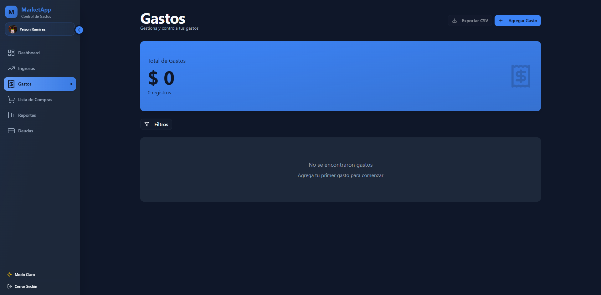
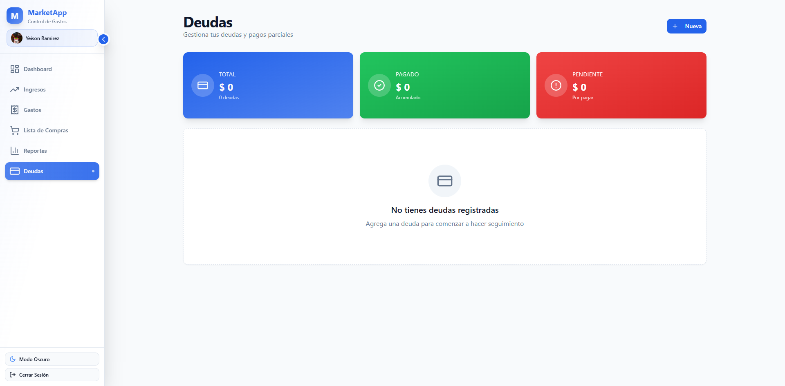
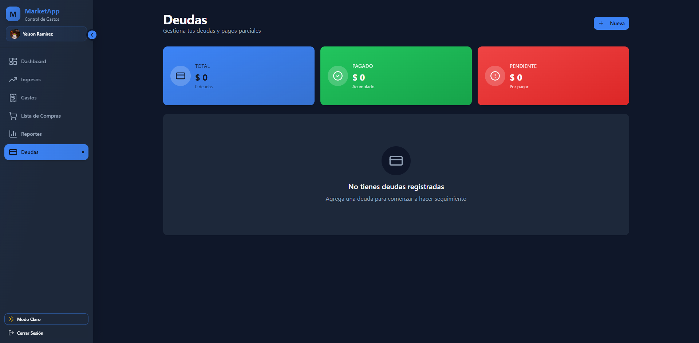

# 💰 MarkeApp - Sistema de Gestión Financiera Personal

<div align="center">


[](https://marke-app.vercel.app/)
[](https://reactjs.org/)
[](https://www.typescriptlang.org/)
[](https://supabase.com/)

**Una aplicación web moderna y completa para gestionar tus finanzas personales**

[🚀 Demo en Vivo](https://marke-app.vercel.app/) | [📖 Documentación](#-tabla-de-contenidos) | [🐛 Reportar Bug](https://github.com/pablo29855/MarkeApp/issues)

</div>

---

## 📋 Tabla de Contenidos

- [Descripción General](#-descripción-general)
- [Características Principales](#-características-principales)
- [Tecnologías Utilizadas](#-tecnologías-utilizadas)
- [Capturas de Pantalla](#-capturas-de-pantalla)
- [Instalación](#-instalación)
- [Uso de la Aplicación](#-uso-de-la-aplicación)
- [Módulos de la Aplicación](#-módulos-de-la-aplicación)
- [Estructura del Proyecto](#-estructura-del-proyecto)
- [Variables de Entorno](#-variables-de-entorno)
- [Scripts Disponibles](#-scripts-disponibles)
- [Contribuir](#-contribuir)
- [Licencia](#-licencia)

---

## 🎯 Descripción General

**MarkeApp** es una aplicación web completa diseñada para ayudarte a tomar el control total de tus finanzas personales. Con una interfaz intuitiva y moderna, podrás registrar ingresos, controlar gastos, gestionar deudas, crear listas de compras y visualizar reportes detallados de tu situación financiera.

### ✨ ¿Por qué MarkeApp?

- 📊 **Visualización Clara**: Dashboard interactivo con gráficos y estadísticas en tiempo real
- 🎨 **Diseño Moderno**: Interfaz responsiva con soporte para modo oscuro/claro
- 🔒 **Seguridad**: Autenticación segura con Supabase y protección con Cloudflare Turnstile
- 📍 **Geolocalización**: Registra la ubicación de tus gastos automáticamente
- 📱 **Responsive**: Funciona perfectamente en dispositivos móviles, tablets y desktop
- 🚀 **Rápido**: Construido con Vite para un rendimiento óptimo

---

## 🌟 Características Principales

### 💵 Gestión de Ingresos
- ✅ Registro de múltiples tipos de ingresos (Nómina, Transferencias, Efectivo)
- ✅ Categorización automática
- ✅ Historial completo de ingresos
- ✅ Filtros por fecha y tipo

### 💸 Control de Gastos
- ✅ Registro detallado de gastos por categorías
- ✅ 11 categorías predefinidas (Arriendo, Educación, Mercado, etc.)
- ✅ Captura automática de ubicación con mapas
- ✅ Exportación de datos a CSV
- ✅ Edición y eliminación de registros

### 🛒 Lista de Compras
- ✅ Organización de productos por comprar
- ✅ Gestión de cantidades
- ✅ Conversión de items a gastos
- ✅ Marcado de productos comprados

### 💳 Gestión de Deudas
- ✅ Registro de deudas con acreedores
- ✅ Seguimiento de pagos parciales
- ✅ Barra de progreso visual
- ✅ Cálculo automático de saldos pendientes

### 📊 Reportes y Análisis
- ✅ Dashboard con estadísticas en tiempo real
- ✅ Gráficos circulares y de barras
- ✅ Comparación de períodos
- ✅ Balance financiero con alertas visuales
- ✅ Detalle por categorías y tipos

### 👤 Gestión de Perfil
- ✅ Autenticación segura
- ✅ Avatar personalizable
- ✅ Datos de usuario editables
- ✅ Protección con CAPTCHA

---

## 🛠 Tecnologías Utilizadas

### Frontend
- **React 18** - Biblioteca de UI
- **TypeScript 5.5** - Tipado estático
- **Vite 6.3** - Herramienta de construcción ultra-rápida
- **React Router DOM 6** - Navegación SPA
- **TailwindCSS 3.4** - Framework de utilidades CSS
- **Shadcn/ui** - Componentes UI accesibles

### Backend & Servicios
- **Supabase** - Backend as a Service (Base de datos, Auth)
- **Cloudflare Turnstile** - Protección CAPTCHA
- **OpenStreetMap** - Mapas y geolocalización
- **Vercel** - Hosting y deployment

### UI/UX
- **Radix UI** - Primitivas de componentes accesibles
- **Lucide React** - Iconos modernos
- **Recharts** - Gráficos interactivos
- **Next Themes** - Soporte para modo oscuro/claro
- **React Hook Form** - Manejo de formularios
- **Zod** - Validación de esquemas

### Herramientas de Desarrollo
- **ESLint** - Linting de código
- **PostCSS** - Procesamiento de CSS
- **Vercel Analytics** - Análisis de uso

---

## 📸 Capturas de Pantalla

### 🔐 Autenticación

#### Inicio de Sesión - Modo Claro
<div align="center">

<p><i>Pantalla de inicio de sesión con protección CAPTCHA de Cloudflare Turnstile</i></p>
</div>

---

### 📊 Dashboard - Panel Principal

<div align="center">
<table>
<tr>
<td></td>
<td></td>
</tr>
<tr>
<td align="center"><b>Dashboard Modo Claro (Sin Datos)</b></td>
<td align="center"><b>Dashboard Modo Oscuro (Sin Datos)</b></td>
</tr>
</table>
</div>

<div align="center">

<p><i>Dashboard con datos reales mostrando estadísticas, gráficos y balance financiero</i></p>
</div>

---

### 💵 Módulo de Ingresos

<div align="center">
<table>
<tr>
<td></td>
<td></td>
</tr>
<tr>
<td align="center"><b>Lista de Ingresos - Modo Claro</b></td>
<td align="center"><b>Lista de Ingresos - Modo Oscuro</b></td>
</tr>
</table>
</div>

#### Flujo de Creación de Ingreso

<div align="center">
<table>
<tr>
<td></td>
<td></td>
</tr>
<tr>
<td align="center"><b>Formulario Vacío - Modo Claro</b></td>
<td align="center"><b>Formulario Vacío - Modo Oscuro</b></td>
</tr>
</table>
</div>

<div align="center">
<table>
<tr>
<td></td>
<td></td>
</tr>
<tr>
<td align="center"><b>Formulario Completado</b></td>
<td align="center"><b>Ingreso Registrado Exitosamente</b></td>
</tr>
</table>
</div>

---

### 💸 Módulo de Gastos

<div align="center">
<table>
<tr>
<td></td>
<td></td>
</tr>
<tr>
<td align="center"><b>Lista de Gastos - Modo Claro</b></td>
<td align="center"><b>Lista de Gastos - Modo Oscuro</b></td>
</tr>
</table>
</div>

#### Flujo de Creación de Gasto con Geolocalización

<div align="center">
<table>
<tr>
<td></td>
<td></td>
</tr>
<tr>
<td align="center"><b>Formulario con Captura de Ubicación</b></td>
<td align="center"><b>Formulario Completado con Mapa</b></td>
</tr>
</table>
</div>

<div align="center">

<p><i>Gasto registrado con ubicación automática y detalles completos</i></p>
</div>

---

### 🛒 Lista de Compras

<div align="center">
<table>
<tr>
<td></td>
<td></td>
</tr>
<tr>
<td align="center"><b>Lista Vacía - Modo Claro</b></td>
<td align="center"><b>Lista Vacía - Modo Oscuro</b></td>
</tr>
</table>
</div>

#### Flujo de Creación de Item de Compra

<div align="center">
<table>
<tr>
<td></td>
<td></td>
</tr>
<tr>
<td align="center"><b>Formulario de Nuevo Item</b></td>
<td align="center"><b>Item Agregado a la Lista</b></td>
</tr>
</table>
</div>

---

### 💳 Gestión de Deudas

<div align="center">
<table>
<tr>
<td></td>
<td></td>
</tr>
<tr>
<td align="center"><b>Módulo de Deudas - Modo Claro</b></td>
<td align="center"><b>Módulo de Deudas - Modo Oscuro</b></td>
</tr>
</table>
</div>

#### Flujo de Creación de Deuda

<div align="center">
<table>
<tr>
<td></td>
<td></td>
</tr>
<tr>
<td align="center"><b>Formulario de Nueva Deuda</b></td>
<td align="center"><b>Deuda Registrada con Progreso</b></td>
</tr>
</table>
</div>

---

### 📈 Reportes y Análisis

<div align="center">
<table>
<tr>
<td></td>
<td></td>
</tr>
<tr>
<td align="center"><b>Reportes Sin Datos - Modo Claro</b></td>
<td align="center"><b>Reportes Sin Datos - Modo Oscuro</b></td>
</tr>
</table>
</div>

<div align="center">

<p><i>Reportes detallados con gráficos circulares, tablas comparativas y balance financiero completo</i></p>
</div>

---

### 🎨 Galería de Temas

La aplicación cuenta con soporte completo para modo claro y oscuro, permitiendo una experiencia visual personalizada según tus preferencias. Todas las pantallas se adaptan automáticamente al tema seleccionado, manteniendo la legibilidad y una estética moderna en ambos modos.

---

## 🚀 Instalación

### Prerequisitos

- Node.js 18+ instalado
- npm o yarn
- Cuenta en Supabase (gratuita)
- Cuenta en Vercel (opcional, para deployment)

### Pasos de Instalación

1. **Clonar el repositorio**

```bash
git clone https://github.com/pablo29855/MarkeApp.git
cd MarkeApp
```

2. **Instalar dependencias**

```bash
npm install
# o
yarn install
```

3. **Configurar variables de entorno**

Crea un archivo `.env.local` en la raíz del proyecto:

```env
VITE_SUPABASE_URL=tu_supabase_url
VITE_SUPABASE_ANON_KEY=tu_supabase_anon_key
VITE_TURNSTILE_SITE_KEY=tu_turnstile_site_key
```

4. **Configurar Supabase**

- Crea un proyecto en [Supabase](https://supabase.com)
- Ejecuta las migraciones de base de datos (ver sección de Base de Datos)
- Configura la autenticación de email

5. **Iniciar el servidor de desarrollo**

```bash
npm run dev
# o
yarn dev
```

La aplicación estará disponible en `http://localhost:3000`

---

## 📖 Uso de la Aplicación

### 1️⃣ Registro e Inicio de Sesión

1. Accede a la aplicación
2. Haz clic en "Regístrate aquí"
3. Completa el formulario con tu información
4. Verifica tu correo electrónico
5. Inicia sesión con tus credenciales

### 2️⃣ Configuración Inicial

1. Accede a tu perfil haciendo clic en el avatar
2. Completa tu información personal
3. Personaliza tu avatar
4. Configura tus preferencias de tema (claro/oscuro)

### 3️⃣ Gestión de Finanzas

#### Registrar un Ingreso
1. Ve a **Ingresos** en el menú lateral
2. Haz clic en "Agregar Ingreso"
3. Completa el formulario:
   - Descripción del ingreso
   - Monto
   - Fecha
   - Tipo de ingreso
   - Notas opcionales
4. Guarda el registro

#### Registrar un Gasto
1. Ve a **Gastos** en el menú lateral
2. Haz clic en "Agregar Gasto"
3. Completa el formulario:
   - Nombre del gasto
   - Monto
   - Fecha
   - Categoría
   - Ubicación (automática o manual)
   - Notas opcionales
4. Guarda el registro

#### Crear Lista de Compras
1. Ve a **Lista de Compras** en el menú lateral
2. Haz clic en "Agregar Item"
3. Ingresa:
   - Nombre del producto
   - Cantidad
   - Categoría
4. Marca como "Comprado" cuando lo adquieras
5. Convierte a gasto si lo deseas

#### Gestionar Deudas
1. Ve a **Deudas** en el menú lateral
2. Haz clic en "Nueva"
3. Registra:
   - Acreedor
   - Monto total
   - Fecha de vencimiento
   - Descripción
4. Agrega pagos parciales cuando realices abonos

### 4️⃣ Análisis de Reportes

1. Ve a **Reportes** en el menú lateral
2. Visualiza:
   - Total de gastos e ingresos del mes
   - Distribución por categorías (gráficos circulares)
   - Balance financiero con indicadores
   - Tablas detalladas por categoría
3. Aplica filtros por fecha si es necesario
4. Expande las secciones para ver detalles

---

## 📦 Módulos de la Aplicación

### 🏠 Dashboard
- Resumen financiero del mes actual
- 4 tarjetas de estadísticas principales
- Gráficos de gastos por categoría
- Últimos gastos registrados
- Balance financiero con indicadores de salud
- Distribución de ingresos por tipo

### 💵 Ingresos
- Lista completa de ingresos
- Filtros por fecha y tipo
- Formulario de registro con validación
- Tipos de ingreso:
  - 💼 Nómina
  - 🏦 Transferencia Bancaria
  - 💵 Efectivo

### 💸 Gastos
- Lista de gastos con detalles
- Exportación a CSV
- Filtros avanzados
- 11 categorías disponibles:
  - 🏠 Arriendo
  - 📚 Educación
  - 🛒 Mercado
  - 🎮 Ocio
  - 📦 Otros
  - 🍽️ Restaurantes
  - 👕 Ropa
  - ⚕️ Salud
  - 💡 Servicios
  - 💻 Tecnología
  - 🚗 Transporte
- Captura de ubicación con mapa interactivo
- Edición y eliminación de gastos

### 🛒 Lista de Compras
- Organización de productos
- Gestión de cantidades
- Categorización
- Marcado de comprados
- Conversión a gastos

### 💳 Deudas
- Registro de deudas
- Seguimiento de pagos
- Barra de progreso visual
- Estadísticas de total, pagado y pendiente
- Historial de abonos

### 📊 Reportes
- Análisis mensual comparativo
- Gráficos circulares por categoría
- Tablas detalladas
- Balance financiero con indicadores:
  - 🟢 Excelente (>50% disponible)
  - 🟡 Atención (20-50% disponible)
  - 🔴 Crítico (<20% disponible)
- Filtros personalizables

### 👤 Perfil
- Datos personales
- Avatar personalizable
- Configuración de cuenta
- Preferencias de usuario

---

## 🗂 Estructura del Proyecto

```
MarkeApp/
├── .playwright-mcp/
│   └── screenshots/          # Capturas de pantalla de documentación
├── public/                   # Archivos estáticos
├── scripts/                  # Scripts de utilidad
├── server/                   # Configuración del servidor
├── src/
│   ├── components/           # Componentes React
│   │   ├── ui/              # Componentes de UI base (shadcn)
│   │   ├── dashboard/       # Componentes del Dashboard
│   │   ├── expenses/        # Componentes de Gastos
│   │   ├── incomes/         # Componentes de Ingresos
│   │   ├── shopping/        # Componentes de Lista de Compras
│   │   ├── debts/           # Componentes de Deudas
│   │   ├── reports/         # Componentes de Reportes
│   │   ├── layout/          # Layout y Sidebar
│   │   ├── profile/         # Componentes de Perfil
│   │   └── theme-provider.tsx
│   ├── hooks/               # Custom React Hooks
│   │   ├── use-mobile.ts
│   │   ├── use-notification.ts
│   │   └── use-toast.ts
│   ├── lib/                 # Utilidades y configuración
│   │   ├── supabase/       # Cliente de Supabase
│   │   ├── types.ts        # Tipos TypeScript
│   │   ├── utils.ts        # Funciones de utilidad
│   │   ├── validation.ts   # Esquemas de validación
│   │   └── export-utils.ts # Utilidades de exportación
│   ├── pages/              # Páginas de la aplicación
│   │   ├── auth/           # Páginas de autenticación
│   │   ├── dashboard/
│   │   ├── expenses/
│   │   ├── incomes/
│   │   ├── shopping/
│   │   ├── debts/
│   │   └── reports/
│   ├── types/              # Definiciones de tipos
│   ├── App.tsx             # Componente principal
│   ├── main.tsx            # Punto de entrada
│   └── index.css           # Estilos globales
├── components.json         # Configuración de shadcn
├── package.json            # Dependencias del proyecto
├── tsconfig.json           # Configuración de TypeScript
├── tailwind.config.ts      # Configuración de TailwindCSS
├── vite.config.ts          # Configuración de Vite
├── vercel.json             # Configuración de Vercel
└── README.md               # Este archivo
```

---

## 🔑 Variables de Entorno

Crea un archivo `.env.local` con las siguientes variables:

```env
# Supabase
VITE_SUPABASE_URL=https://tu-proyecto.supabase.co
VITE_SUPABASE_ANON_KEY=tu_clave_anonima_de_supabase

# Cloudflare Turnstile (CAPTCHA)
VITE_TURNSTILE_SITE_KEY=tu_clave_del_sitio_turnstile

# Opcional: Analytics
VITE_VERCEL_ANALYTICS_ID=tu_id_de_analytics
```

### Obtener las Credenciales

#### Supabase
1. Crea una cuenta en [supabase.com](https://supabase.com)
2. Crea un nuevo proyecto
3. Ve a Settings → API
4. Copia la `URL` y la `anon/public key`

#### Cloudflare Turnstile
1. Ve a [Cloudflare Dashboard](https://dash.cloudflare.com)
2. Accede a Turnstile
3. Crea un nuevo sitio
4. Copia la Site Key

---

## ⚙️ Scripts Disponibles

```bash
# Desarrollo
npm run dev          # Inicia el servidor de desarrollo

# Producción
npm run build        # Compila la aplicación para producción
npm run preview      # Preview de la build de producción

# Linting
npm run lint         # Ejecuta ESLint para revisar el código
```

---

## 🗃️ Base de Datos (Supabase)

### Tablas Principales

#### `profiles`
```sql
- id (uuid, PK)
- email (text)
- full_name (text)
- avatar_url (text)
- created_at (timestamp)
- updated_at (timestamp)
```

#### `incomes`
```sql
- id (uuid, PK)
- user_id (uuid, FK)
- description (text)
- amount (numeric)
- date (date)
- type (text)
- notes (text)
- created_at (timestamp)
```

#### `expenses`
```sql
- id (uuid, PK)
- user_id (uuid, FK)
- name (text)
- amount (numeric)
- date (date)
- category (text)
- location (text)
- latitude (numeric)
- longitude (numeric)
- notes (text)
- created_at (timestamp)
```

#### `shopping_items`
```sql
- id (uuid, PK)
- user_id (uuid, FK)
- name (text)
- quantity (integer)
- category (text)
- purchased (boolean)
- created_at (timestamp)
```

#### `debts`
```sql
- id (uuid, PK)
- user_id (uuid, FK)
- name (text)
- amount (numeric)
- paid_amount (numeric)
- due_date (date)
- description (text)
- status (text)
- created_at (timestamp)
```

---

## 🤝 Contribuir

¡Las contribuciones son bienvenidas! Si deseas contribuir al proyecto:

1. Fork el repositorio
2. Crea una rama para tu feature (`git checkout -b feature/AmazingFeature`)
3. Commit tus cambios (`git commit -m 'Add: nueva característica'`)
4. Push a la rama (`git push origin feature/AmazingFeature`)
5. Abre un Pull Request

### Guía de Estilo

- Usa TypeScript para todo el código nuevo
- Sigue las convenciones de ESLint configuradas
- Escribe nombres de componentes en PascalCase
- Usa funciones flecha para componentes
- Documenta funciones complejas

---

## 📝 Licencia

Este proyecto está bajo la Licencia MIT. Ver el archivo `LICENSE` para más detalles.

---

## 👨‍💻 Autor

**Pablo Romero**
- GitHub: [@pablo29855](https://github.com/pablo29855)

---

## 🤝 Colaboradores

Agradecimientos especiales a todos los que han contribuido al proyecto:

<table>
<tr>
<td align="center">
<a href="https://github.com/YeisonRamirezSuarez">
<sub><b>Yeison Ramirez Suarez</b></sub>
</a><br />
<a href="https://github.com/pablo29855/MarkeApp/commits?author=YeisonRamirezSuarez" title="Code">💻</a>
<a href="#ideas" title="Ideas & Planning">🤔</a>
<a href="#test" title="Testing">🧪</a>
</td>
</tr>
</table>

---

## 🙏 Agradecimientos

- [Supabase](https://supabase.com) - Backend as a Service
- [Vercel](https://vercel.com) - Hosting y deployment
- [Shadcn/ui](https://ui.shadcn.com) - Componentes UI
- [Radix UI](https://www.radix-ui.com) - Primitivas accesibles
- [Lucide](https://lucide.dev) - Iconos
- [OpenStreetMap](https://www.openstreetmap.org) - Mapas

---

## 🔮 Roadmap

### Próximas Características

- [ ] 📱 Aplicación móvil nativa (React Native)
- [ ] 🔔 Notificaciones push
- [ ] 📊 Exportación de reportes en PDF
- [ ] 💱 Soporte multi-moneda
- [ ] 🤖 Predicciones con IA
- [ ] 🔄 Sincronización en tiempo real
- [ ] 👥 Cuentas compartidas/familiares
- [ ] 📅 Recordatorios de pagos
- [ ] 🏦 Integración bancaria
- [ ] 📈 Metas de ahorro

---

## 🐛 Reportar Problemas

Si encuentras algún bug o tienes sugerencias, por favor abre un [issue en GitHub](https://github.com/pablo29855/MarkeApp/issues).

---

<div align="center">

**⭐ Si te gusta este proyecto, no olvides darle una estrella en GitHub ⭐**

Hecho con ❤️ por [Pablo Romero](https://github.com/pablo29855)

</div>
